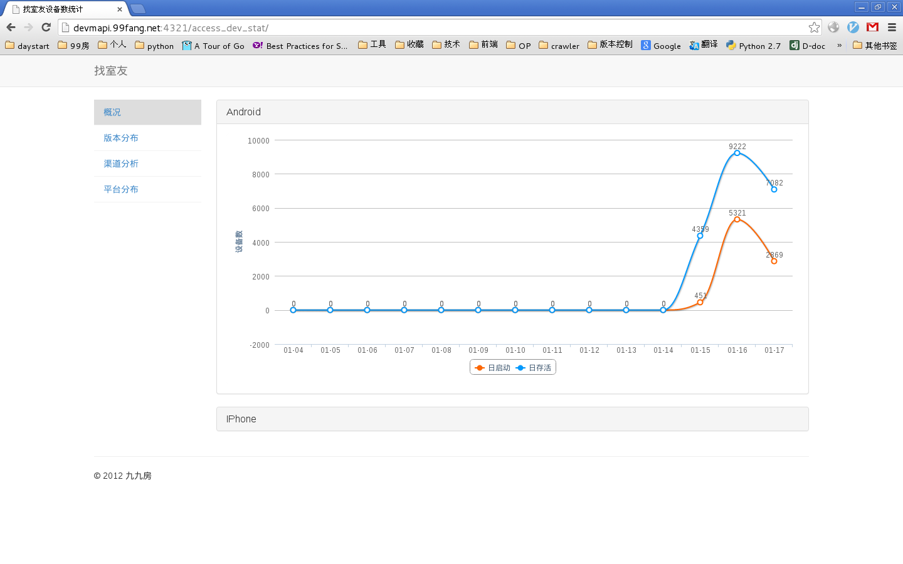
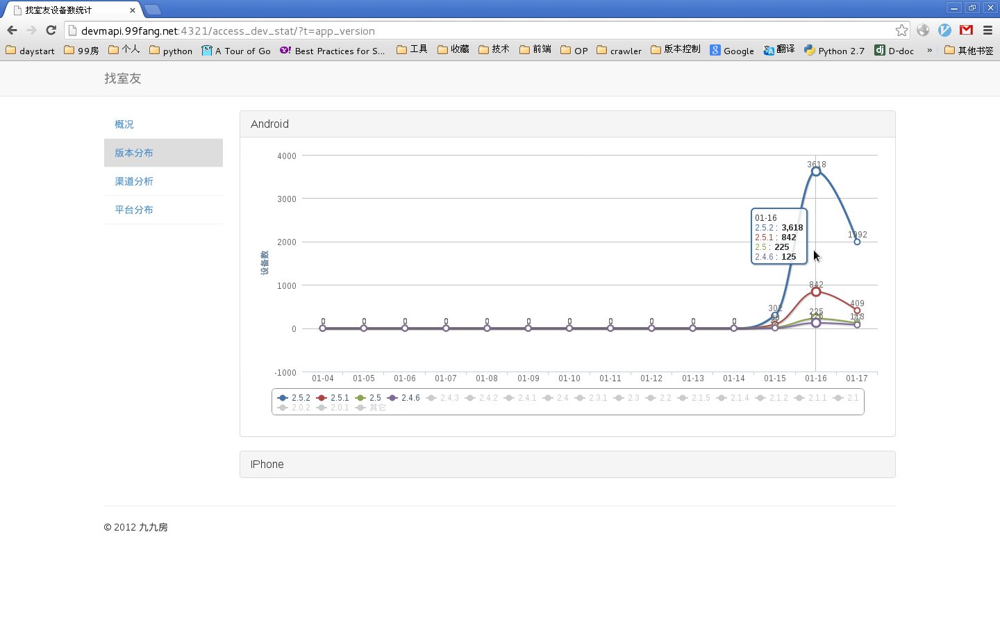
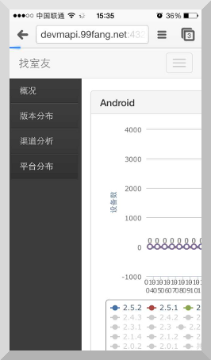

================
AccessDevStat
================

AccessDevStat(short of Access Device Statistics) is a simple Django middleware to collect device info from every agent.

And also it offered charts to show these device statistics. 

From these charts, you can find: 

    #. the the number of devices which are alive or opened in 2 weeks.

    #. app channels, app versions, app platfrom statistics.

Here is some screen shot from my django app.

[]

[]

By the way, it also do good on mobile.

[]

[]

[quick start](<https://github.com/yijingping/django-access-dev-stat/blob/master/docs/quickstart.rst>)
