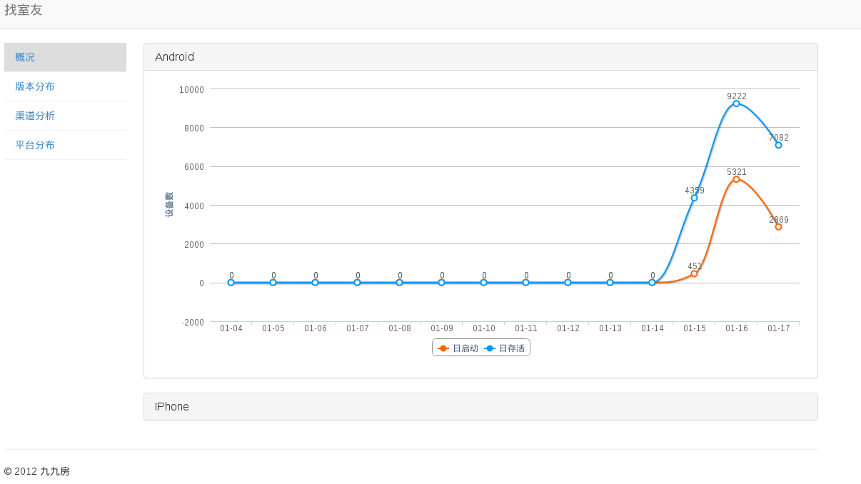
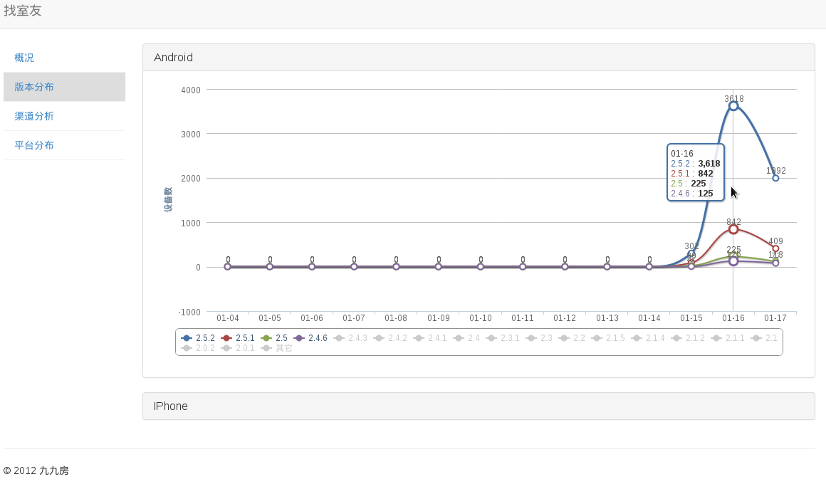
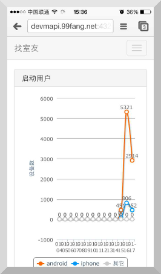
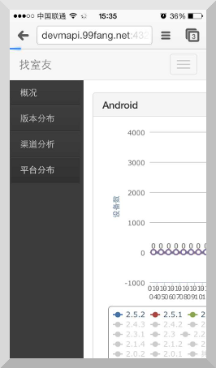

AccessDevStat
================

AccessDevStat(short of Access Device Statistics) is a simple Django middleware to collect device info from every agent.

And also it offered charts to show these device statistics. 

From these charts, you can find: 

* the the number of devices which are alive or opened in 2 weeks.

* app channels, app versions, app platfrom statistics.

Screenshots
---------------

Here is some screen shot from my django app.

By the way, it also do good on mobile.

 

Quick Start
---------------
[Index](<docs/index.rst>)
